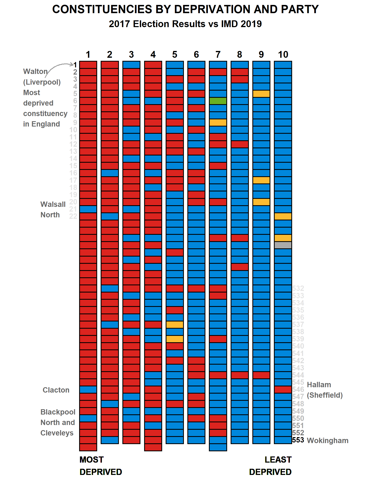

# Deprivation by constituency

Once every 4-5 years, MHCLG releases the Index of Multiple Deprivation (IMD) dataset. The IMD contains local level measures of various domains of deprivation, and is used to inform various local & national policies.

The House of Commons Library have mapped the 2019 IMD data to constituencies (data & report [here](https://researchbriefings.parliament.uk/ResearchBriefing/Summary/CBP-7327)). Alasdair Rae has used the data to make some fab visualisations on his [blog](http://www.statsmapsnpix.com/2019/11/a-deprivation-by-constituency-chart.html).

This repo contains code to :

* (roughly!) recreate Alasdair's visualisation of votes against deprivation
* compare deprivation in Clacton - the most deprived constituency in Essex - against the other constituencies in England

# Output

Running `graph.r` recreates Alasdair's original visualisation:

	

Running `comparison.r` outputs a graph showing the distribution of scores for each deprivation domain. The Essex constituencies are highlighted in blue, and Clacton is highlighted in orange: