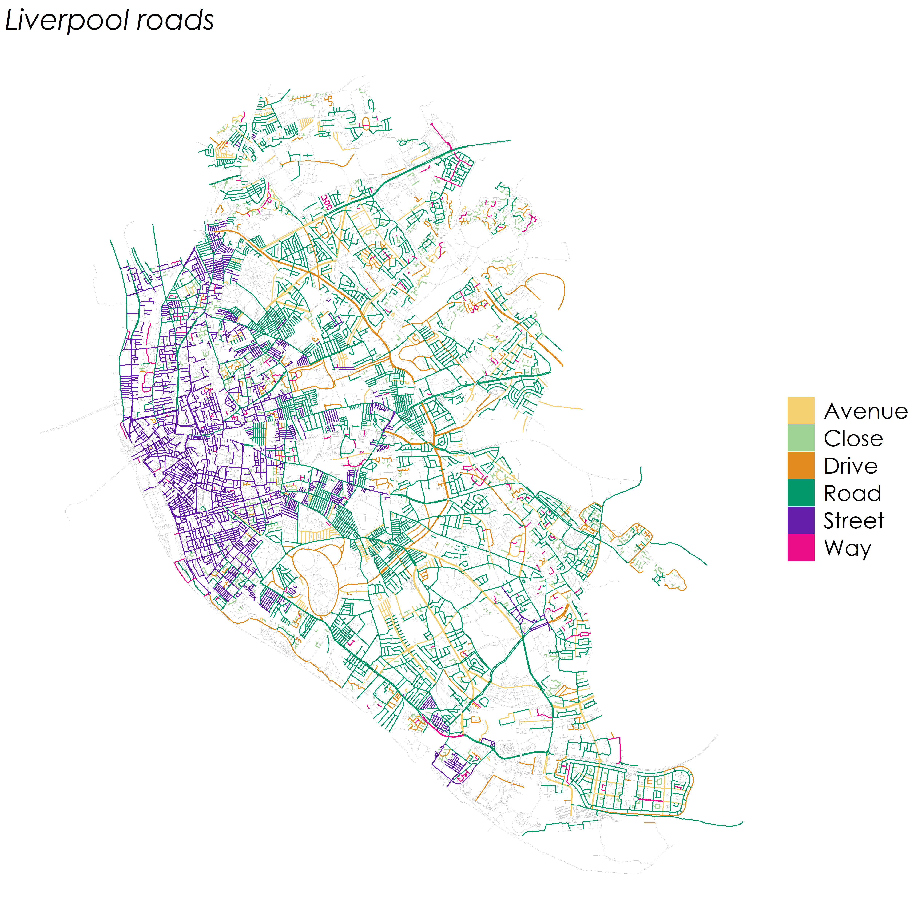

# Roadnames

Create maps of all roads in an area, coloured by road type ('Street', 'Road', 'Avenue', ...).

Shapefiles aren't included due to file size. If you want to run the code you'll need to grab the local authority shapefile from [ONS geoportal](https://geoportal.statistics.gov.uk/search?collection=Dataset&sort=name&tags=all(BDY_LAD%2CDEC_2019)), and the roads shapefile from [OSM](https://download.geofabrik.de/europe/great-britain.html).

	
	

